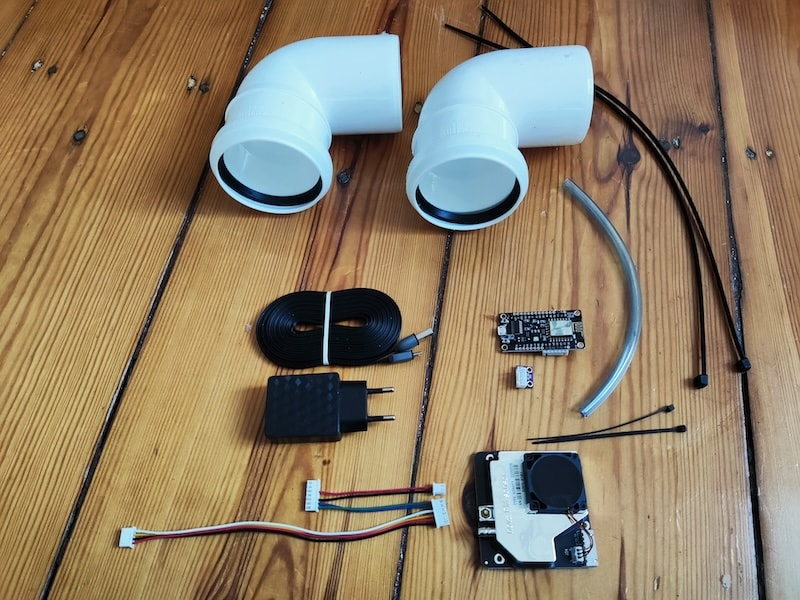
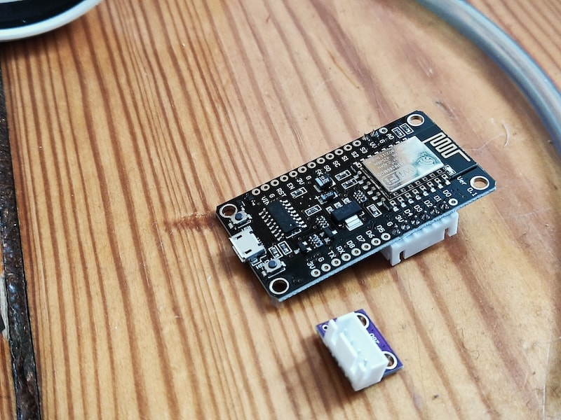
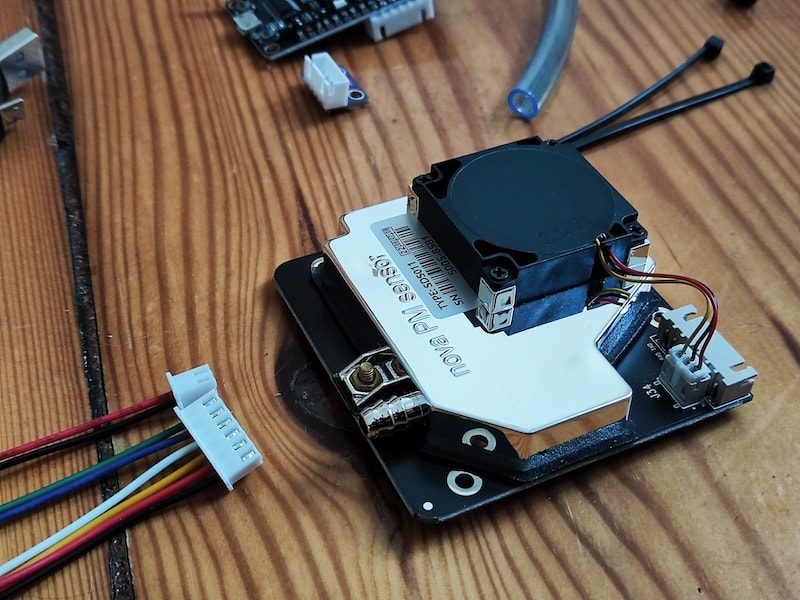
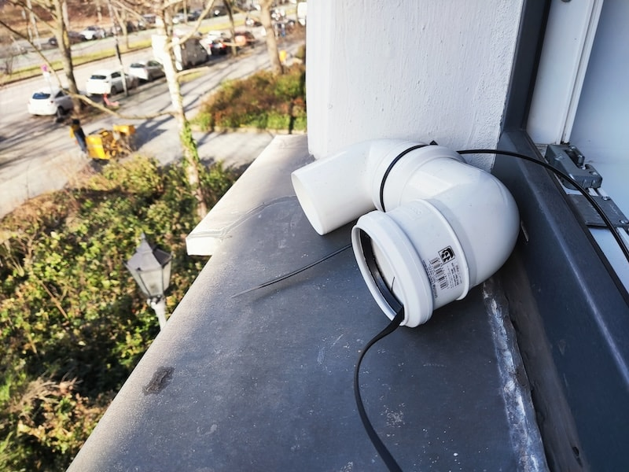

While attending this year's Chaos Communication Congress in Hamburg, I saw a pretty inspiring talk from two researchers in the field of numerical pollution modeling. They were combining data from all kinds of sources, including a DIY sensor network run by volunteers, to create models that can improve city planning, life quality, and ultimately address the problem of air pollution. I can really recommend watching the whole thing:

<iframe width="100%" style="aspect-ratio: 16/9;" src="https://media.ccc.de/v/37c3-11975-numerical_air_quality_modeling_systems/oembed" frameborder="0" allowfullscreen></iframe>

One of their slides mentioned the website [sensor.community](https://sensor.community/) which tracks all volunteer-run air quality sensors, and provides DIY guides to build your own air quality and noise pollution sensors. When I got home after the conference, I bought the pieces to assemble the DIY [AirRohr device](https://sensor.community/en/sensors/airrohr/). I live on a pretty busy street in Berlin, and wanted to get a sense of how much air pollution is affecting my area.

Here are all the pieces ready to be assembled on my living room floor:

### The NodeMCU CPU/WLAN + BME280 temperature sensor

This piece is responsible for powering the sensors, and communicating the collected data back to my WiFi router. Flashing the firmware for this was not possible with my Macbook Pro (M2, 2023). I used an old Linux laptop to do this instead, which was much more straightforward.

### The SDS011 fine dust sensor

A clear plastic tube is connected to the nozzle on this piece, and a small fan circulates air through the sensor.

### Fully assembled kit fixed to my apartment window

The white pipe provides a little housing for the electronics inside. A 3m USB cable runs under the window frame to power the the device. It's fixed to the window with some zip ties.

After a little bit of configuration, the device started wirelessly emitting data back to the sensor.community network!

### Live data: fine dust, 10 µm

<iframe src="https://api-rrd.madavi.de:3000/grafana/d-solo/GUaL5aZMz/pm-sensors?orgId=1&var-chipID=esp8266-5627249&var-type=SDS011&var-query0=sensors&from=1706310000000&panelId=5" width="100%" style="aspect-ratio: 3/2;" frameborder="0"></iframe>

### Live data: fine dust, 2.5 µm

<iframe src="https://api-rrd.madavi.de:3000/grafana/d-solo/GUaL5aZMz/pm-sensors?orgId=1&var-chipID=esp8266-5627249&var-type=SDS011&var-query0=sensors&from=1706310000000&panelId=13" width="100%" style="aspect-ratio: 3/2;" frameborder="0"></iframe>

As of the date of this blog post, the device has been collecting data for about a week. It's already quite interesting to see the patterns of weekday rush-hour traffic and how they affect the air quality in my area.
